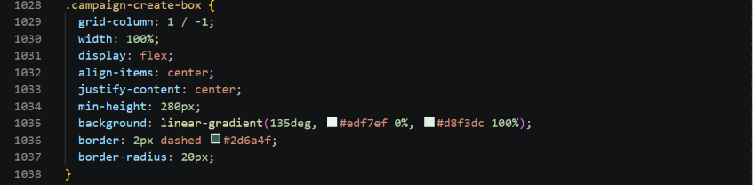
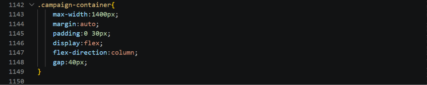
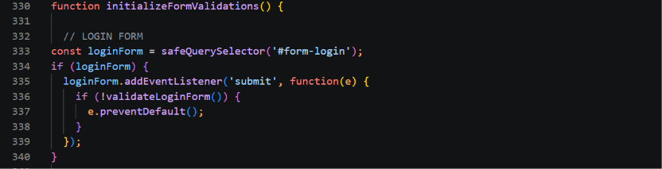
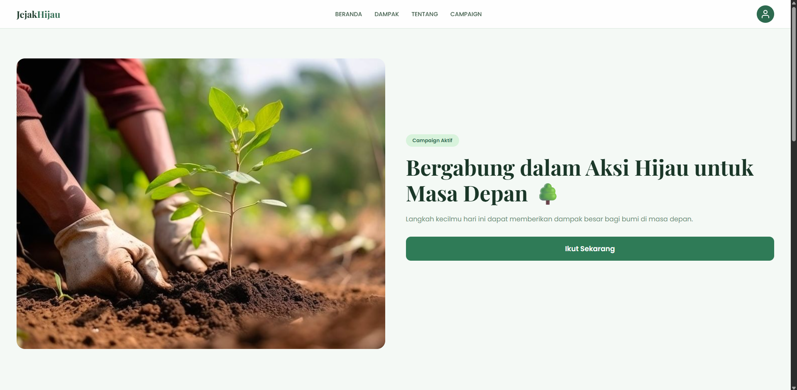
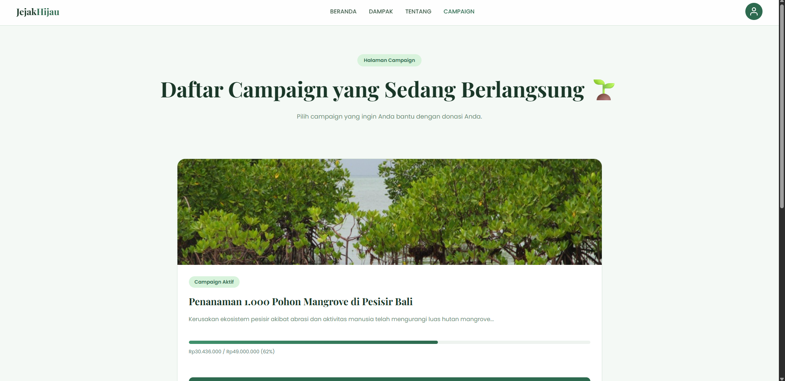
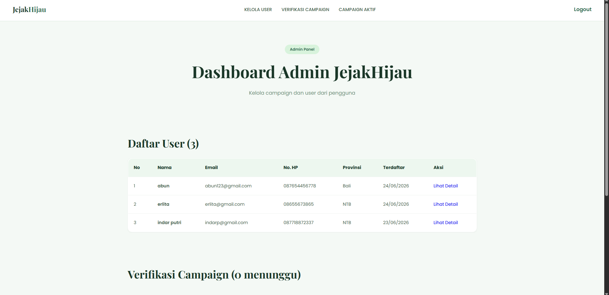

# JejakHijau

## Deskripsi
JejakHijau merupakan sebuah platform campaign lingkungan dan donasi penghijauan berbasis web yang bertujuan untuk membantu masyarakat berkontribusi dalam menjaga lingkungan melalui aksi nyata. Platform ini memungkinkan pengguna untuk melakukan donasi terhadap campaign penanaman pohon yang sedang berlangsung maupun membuat campaign sendiri.

## Alamat
Localhost

## Team Members and Responsibilities
| No | Nama Anggota | Role | Tanggung Jawab |
|---|---|---|---|
| 1 | Khofipah Indar Putri | Frontend / UI-UX | Membuat tampilan website, landing page, navigation bar, tampilan campaign, halaman donasi, halaman profile, serta mengatur keseluruhan desain antarmuka website menggunakan HTML, CSS, dan JavaScript. |
| 2 | Erlita Jannatul Aulia | Backend / Database | Membuat sistem login dan register, struktur database, sistem campaign, sistem donasi, session login, upload file, validasi form, serta integrasi backend menggunakan PHP dan MySQL. |
| 3 | Yunda Hayatus Soleha | Content / Dokumentasi | Menyusun konsep website, membuat isi konten campaign dan awareness lingkungan, melakukan testing website, membuat sitemap, dokumentasi project, laporan, serta menyiapkan bahan presentasi project. |

## NIM Anggota Kelompok
- Khofipah Indar Putri: F1D02410062
- Erlita Jannatul Aulia: F1D02410006
- Yunda Hayatus Soleha: F1D02410029

## Menu Utama

###  Aktor User
User merupakan pengguna website yang dapat melakukan donasi campaign lingkungan maupun membuat campaign penghijauan baru.

| No | Menu | Deskripsi |
|----|------|-----------|
| 1 | Register | Membuat akun baru |
| 2 | Login | Masuk ke akun yang sudah terdaftar |
| 3 | Beranda | Halaman utama berisi informasi platform |
| 4 | Campaign | Melihat daftar campaign lingkungan yang tersedia |
| 5 | Detail Campaign | Melihat informasi lengkap dan donatur campaign |
| 6 | Donasi | Mengisi form donasi dan upload bukti transfer |
| 7 | Buat Campaign | Membuat campaign penghijauan baru |
| 8 | Profil | Melihat data diri |
| 9 | Edit Profil | Mengubah data diri |
| 10 | Logout | Keluar dari akun |

###  Aktor Admin
Admin bertugas mengelola dan memantau seluruh aktivitas yang berjalan di platform.

| No | Menu | Deskripsi |
|----|------|-----------|
| 1 | Login Admin | Masuk ke dashboard khusus admin |
| 2 | Dashboard | Memantau data user, campaign aktif, dan verifikasi campaign user |
| 3 | Kelola User | Melihat data dan aktifitas riwayat donasi dan campaign |
| 4 | Kelola Campaign | Melihat campaign yang aktif dan menghapus campaign yang aktif |
| 5 | Verifikasi Campaign | Menyetujui/menolak/menghapus campaign |
| 6 | Logout | Keluar dari dashboard admin |

## SiteMap
```
JejakHijau/
├── index.php                  # Landing page
├── login.php                  # Login user
├── signup.php                 # Registrasi user
├── logout.php                 # Logout session
├── campaigns.php              # Daftar campaign
├── campaign-detail.php        # Detail campaign
├── donation.php               # Form & proses donasi
├── create-campaign.php        # Buat campaign baru
├── profile.php                # Profil user
├── edit-profile.php           # Edit profil user
├── admin-login.php            # Login admin
├── admin-dashboard.php        # Dashboard admin
├── users-detail.php           # Detail user (admin)
├── config.php                 # Koneksi DB & konfigurasi
├── session-check.php          # Helper session
├── validation.js              # Validasi form (JS)
├── main.js                    # Script utama (JS)
├── style.css                  # Stylesheet utama
├── database_jejakhijau.sql    # Struktur & data database
├── assets/                    # Gambar & media
└── uploads/                   # File upload user
    ├── campaigns/             # Gambar campaign
    └── donations/             # Bukti transfer
```

## Teknologi
- Frontend : HTML, JavaScript, CSS
- Backend : PHP
- Database : MySQL
- Local Server : XAMPP

## Requirement

Untuk menggunakan JejakHijau ini, anda harus menginstall dan konfigurasi berikut:
- XAMPP
- PHP 8+
- Browser

## Bug Log
### BUG 1: Card Campaign Aktif Tidak Menampilkan dengan Baik
- Gejala : Tampilan card untuk menampilkan campaign aktif tidak sesuai dengan desain (card campaign aktif bertumpuk)
- Langkah Reproduksi : Membuka halaman campaign atau dashboard utama, lihat section campaign aktif
- Hipotesis Penyebab : Struktur HTML card salah atau CSS styling tidak sesuai dengan elemen
- Fix : Memperbaiki struktur HTML card campaign dan styling CSS pada style.css dengan mengganti flex menjadi grid
- Bukti : Perubahan kode yang dilakukan



### BUG 2: Login Form Tidak Terkirim ke Server (validation.js Menghalangi)
- Gejala: Form login tidak bisa submit ke server meskipun credentials sudah diisi dengan benar.
- Langkah reproduksi: Isi username dan password di halaman login, klik tombol login, form tidak terkirim.
- Hipotesis penyebab: File validation.js melakukan e.preventDefault() yang menghentikan form submission sebelum request terkirim ke server.
- Fix: Memodifikasi validation.js agar e.preventDefault() hanya dijalankan jika validation gagal, memungkinkan form submit ke server jika validation sukses.
- Bukti: Perubahan kode yang dilakukan



## AI Usage Statement
#### 1

1. Tool                           : ChatGPT
2. Untuk apa                      : Brainstorming dan diskusi solusi pemrograman
3. 2-3 prompt utama               :
    - Apa saja fitur yang harus ada pada situs campaign?
    - Apakah ada alternatif yang lebih mudah pengganti fitur yang kompleks?
4. Bagian output AI yang dipakai  : Penjelasan konsep, saran perbaikan kode.
5. Bagian yang saya ubah + alasan : Kode dan implementasi akhir disesuaikan kembali dengan kebutuhan proyek, alur sistem yang digunakan dan kesanggupan dari kompleksitas perancangan web.

#### 2

1. Tool                           : Claude
2. Untuk apa                      : Mencari bug dan mengevaluasi keanehan pada sistem
3. 2-3 prompt utama               :
   - Dari project web saya yang sudah jadi, adakah bug atau keanehan yang di temukan?
   - Bagaimana solusi untuk memperbaiki bug pada fitur error yang saya alami ini?
   - Mengapa fitur yang ada di web saya tidak sinkron?
4. Bagian output AI yang dipakai  : Kode implementasi perbaikan dari kode yang salah sebelumnya.
5. Bagian yang saya ubah + alasan : Menambahkan ataupun mengubah kode yang sebelumnya terdapat error diantaranya terdapat pada bug yang telah dijelaskan sebelumnya

#### 3

1. Tool                           : Claude
2. Untuk apa                      : Referensi dan inspirasi tampilan User Interface (UI)
3. 2-3 prompt utama               :
   - Bagaimana cara membuat konten card campaign yang dinamis?
   - Bagaimana design layout untuk halaman campaign yang baik?
4. Bagian output AI yang dipakai  : Referensi layout, penempatan komponen, dan ide desain antarmuka.
5. Bagian yang saya ubah + alasan : beberapa elemen layout diubah agar sesuai dengan identitas dan kebutuhan website JejakHijau.


# Beranda 


# Halaman Campaign


# Dashboard Admin

